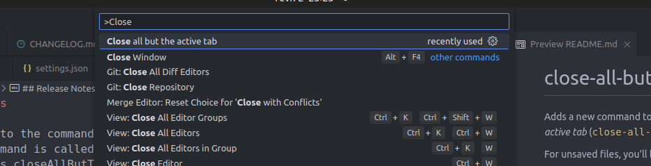

# close-all-but-this

Adds a new command to the command palette which closes all tabs except for the active one. The command is called _Close all but the active tab_ (`close-all-but-this.closeAllButThis`).

For unsaved files, you'll be prompted to save them first.

For simplicity, if you have more than one tab group, the active tab in each group will remain open.

## Extension Settings

This extension does not include any settings but you can bind the command to a keyboard shortcut if you wish.

## Release Notes

### 0.0.1

Initial release

### 0.0.2

Update readme

### 0.0.3

Update readme